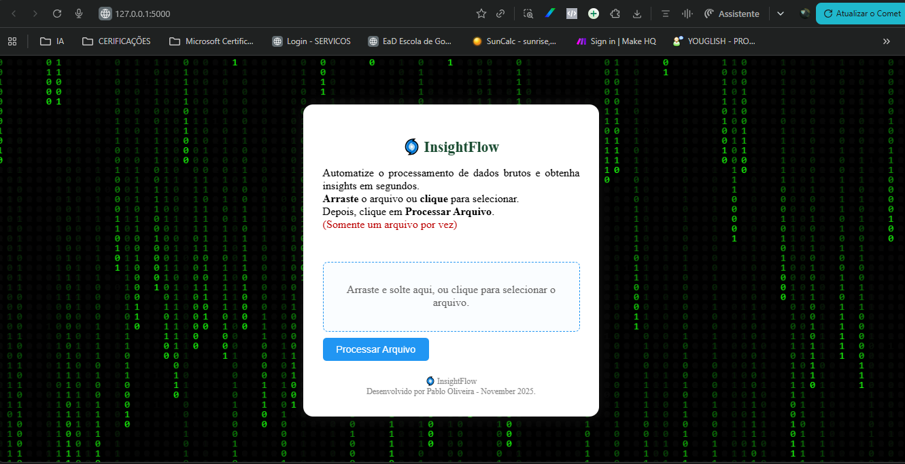

## 🌀 InsightFlow

Aplicação web para processamento automatizado e inteligente de dados corporativos, 
convertendo dados brutos em fluxos de insights acionáveis para análise e tomada de decisão.

##Significado do nome InsightFlow
🌀 InsightFlow significa fluxo contínuo de entendimento aprofundado. 
Expressa a proposta de um software que revela, de maneira dinâmica e automatizada, 
os principais aprendizados e sentidos ocultos dentro de grandes volumes de dados.

🌀 (turbilhão/fluxo) = fluxo de dados, transformação.

## Visão principal do InsightFlow

> **Legenda:** Interface principal do InsightFlow destacando o upload do arquivo, 
			   painel central com efeito Matrix binário, branding personalizado e 
			   rodapé autoral.

##🚀 Funcionalidades
- Upload via web (arrastar/soltar ou seleção tradicional)
- Aceita arquivos .xls e .xlsx
- Busca automática por cabeçalhos relevantes a partir de qualquer linha
- Limpeza inteligente: mantém apenas as colunas essenciais (Event, Count, Classification, etc)
- Agrupamento com soma (tipo tabela dinâmica): une linhas iguais, soma os valores numericamente
- Ordenação decrescente do resultado
- Arquivo tratado salvo SEMPRE como .xlsx, pronto para Excel ou Power BI
- Aba do Excel renomeada automaticamente
- Regra especial para arquivos TopImpactedHost: corrige deslocamento da coluna "Count"
- Interface responsiva, intuitiva, com feedback visual

##🏗️ Estrutura do Projeto

insightflow/
├── app.py                  # Backend principal Flask
├── templates/
│   └── index.html          # Interface web (drag and drop)
└── uploads/                # Diretório temporário para processamento

##⚙️ Instalação
Ambiente virtual (opcional/recomendado):

python -m venv venv
venv\Scripts\activate    # Windows
source venv/bin/activate # Linux/MacOS

Instale as dependências:
- pip install flask pandas openpyxl xlrd

##🚀 Como usar
Execute a aplicação:

python app.py

- Acesse a interface via navegador em http://localhost:5000 (ou pelo IP local na rede exibido no console).
- Arraste ou selecione o arquivo .xls/.xlsx exportado do LogRhythm.
- Apenas um arquivo por vez.
- Clique em Processar Arquivo.
- O arquivo tratado será baixado automaticamente em formato .xlsx com a aba renomeada.

##🎯 Regras de tratamento
- Busca flexível pelo cabeçalho relevante em todas as linhas do arquivo
- Mantém apenas as colunas de interesse:
- Recipient, Sum_LogCount, Sender, Impacted Host, Count, Origin Host, Object, Origin Login, Threat Name, Classification, Event, Log Host, Total Logs, Alarm Rule Name, Total Count
- Regra especial: para arquivos com TopImpactedHost no nome, corrige automaticamente a coluna "Count" quando está uma linha abaixo do esperado.
- Agrupa e soma os dados (como tabela dinâmica do Excel)
- Exporta sempre como .xlsx e nomeia a aba pelo arquivo

##📄 Arquivo .gitignore
Para garantir que somente os arquivos essenciais do projeto sejam versionados, adicione um .gitignore com as linhas recomendadas:

- Ignorar ambientes virtuais
venv/
.env

- Arquivos temporários Python
__pycache__/
*.pyc
*.pyo
*.pyd

- Arquivos temporários de editor
*.swp
*.swo
*.bak
*.tmp
*.log

- Diretório de uploads e arquivos tratados
uploads/
*.xlsx
*.xls

- Arquivos de sistema
.DS_Store
Thumbs.db

- Arquivos sensíveis e de configuração
config.yaml
*.key
*.pem
	
> **Dica:** Nunca suba arquivos de dados, temporários ou confidenciais ao seu repositório GitHub.
	Mantenha o repositório limpo e seguro apenas com código, templates e documentação.

##📜 Licença
Este projeto está licenciado sob a licença MIT.
Veja o arquivo LICENSE para mais informações.

##👤 Autor
Desenvolvido por Pablo Nunes de Oliveira
versão 1 - 01 Novembro 2025
Contato: pabloliveir@gmail.com